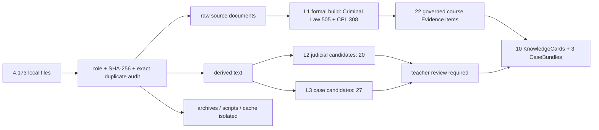

# Criminal-Law Governed Source Dataset Card

## Scope

This card describes a read-only inventory of the local legal source workspace as of `2026-08-31`. The inventory is a candidate pool, not a training set and not a published legal knowledge base.

## Provenance layers

## Current inventory

- Files: **4173**
- Bytes: **255164821**
- Extensions: TXT 2616, DOCX 1458, DOC 53, ZIP 30
- Raw source subfolders: law 347, judicial 553, regulation 610, cases 530
- Exact duplicate groups: **0**
- Existing formal RAG corpus: **813 articles** (Criminal Law 505; Criminal Procedure Law 308)
- Course layer: **10 KnowledgeCards, 30 objective tasks, 13 subjective/role tasks, 3 CaseBundles**

The local disk has **53 `.doc` files**, not 530. The number 530 refers to case text files in `output_cases`/source cases, and must not be presented as a DOC count.

## Governance decisions

- `candidate_requires_legal_review`: 47
- `formal_source_artifact`: 3
- `isolated_outside_scope`: 2806
- `isolated_reference`: 679
- `rejected_from_content_pipeline`: 577
- `rejected_from_formal_evidence`: 61

## Admission policy

1. Only the existing governed 813-article build is formal L1 normative Evidence.
2. L2/L3 title matches are candidates marked `candidate_requires_legal_review`; title matching does not establish validity, relevance or legal entailment.
3. Case materials from a third-party database require license, redistribution and personal-information review.
4. Archives, scripts, caches and aggregate category files are excluded from citable Evidence.
5. Every formal Evidence item must retain title, article, exact quote, source, version/effective status, SHA and review status.
6. Validity must be rechecked before each real classroom term.

## Intended use

- Source governance demonstrations;
- candidate selection for teacher review;
- governed RAG and LegalEduEval construction;
- reproducible file-level audit.

## Not supported

- claiming 4,173 training samples;
- treating all files as high-quality or current law;
- calling Silver/model-generated labels teacher Gold;
- redistributing third-party cases without review;
- deriving classroom effectiveness from corpus size.
